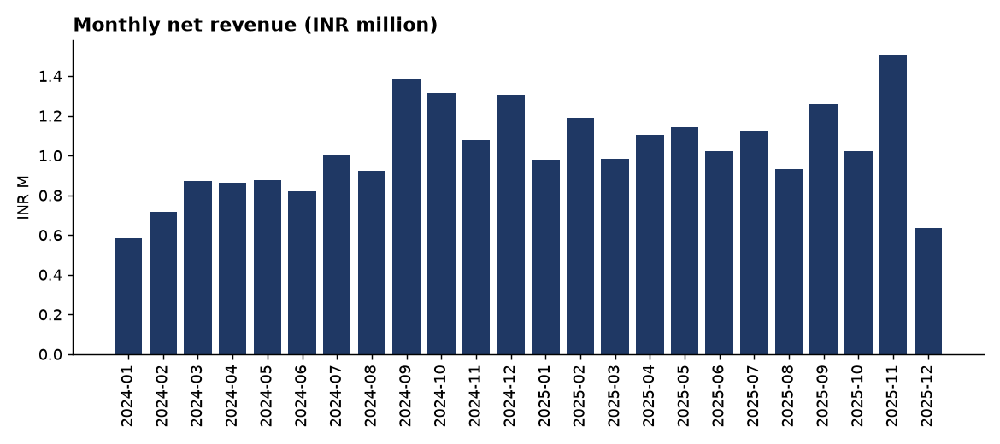
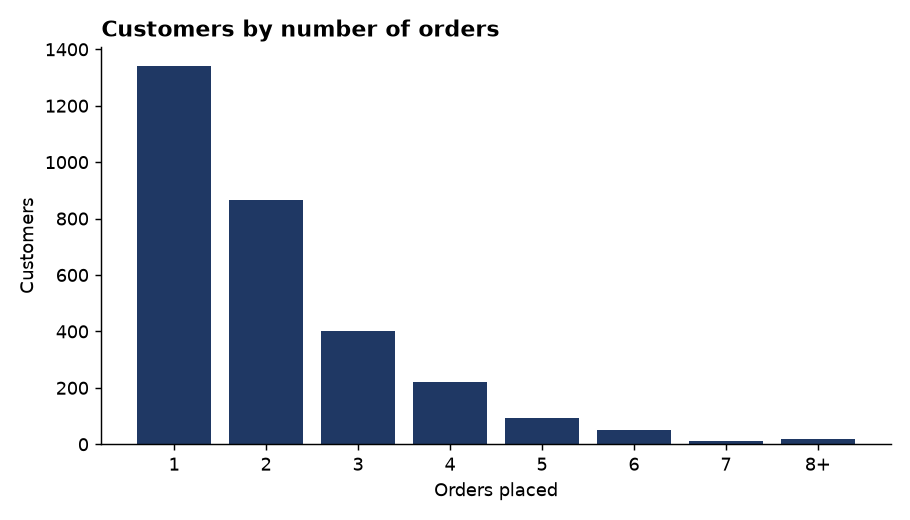
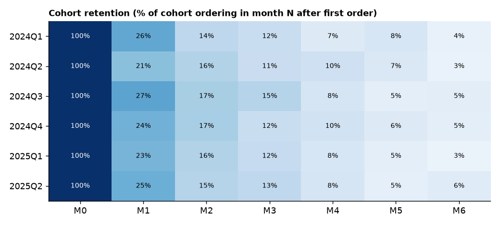
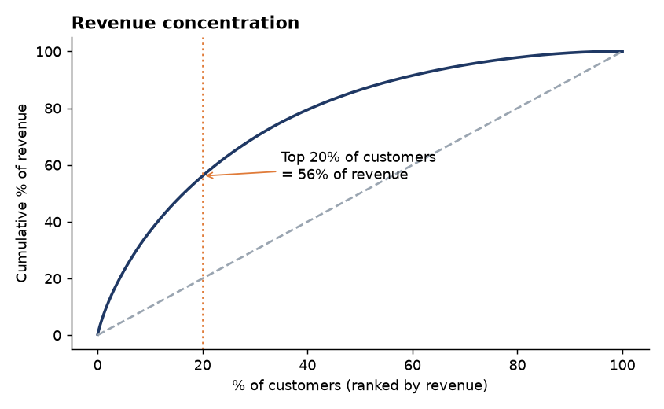
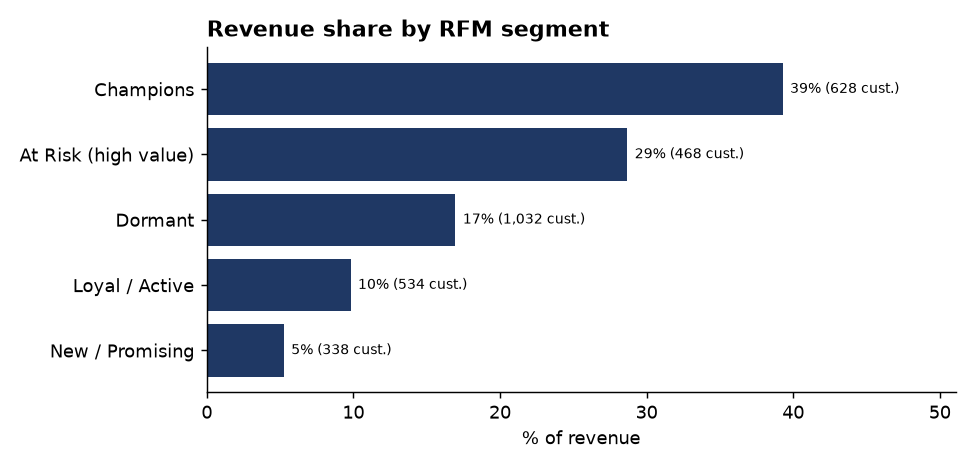
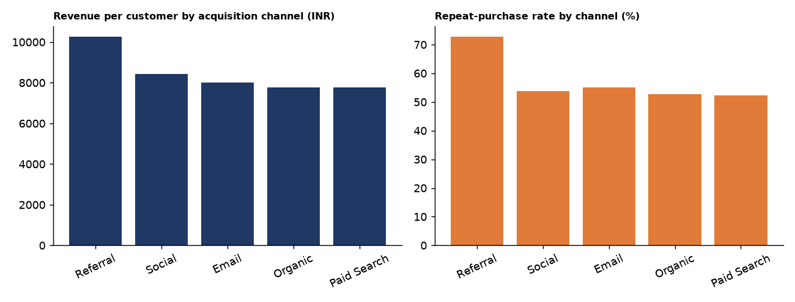
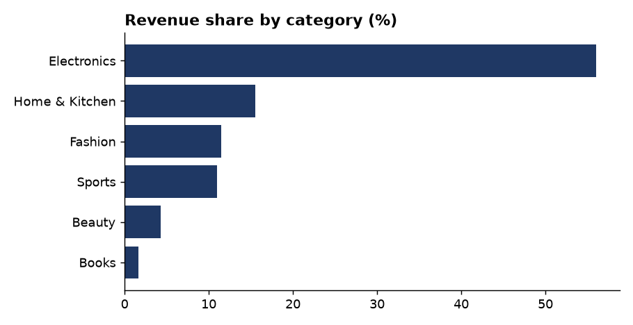

# Customer & Revenue Analysis - E-commerce (2024-2025)

> Data: synthetic e-commerce dataset (`data/ecom_orders.csv`, `data/ecom_customers.csv`) - 3,000 customers, 6,168 orders.
> Replace with a real dataset (e.g. Online Retail II) and re-run `analysis.py`; the report numbers regenerate automatically.

## 1. Business questions
1. Is revenue seasonal, and how large is the peak?
2. Do customers come back? How quickly do cohorts decay?
3. How concentrated is revenue among a few customers?
4. Which customer groups (RFM), segments and acquisition channels create the most value?
5. What should the business do differently?

## 2. Data preparation
- Joined orders to customers on `customer_id`; parsed dates; built `month`, cohort and RFM fields.
- Quality checks: {'duplicate order_ids': 0, 'orders with unknown customer': 0, 'missing values': 0, 'non-positive order values': 0, 'orders before signup': 0}. No rows needed removal; all checks passed unless a non-zero count is listed.
- **Assumption:** returned orders (6.0% of orders) are fully refunded, so *net revenue* excludes them. Gross INR 26,266,768 -> net INR 24,633,378.

## 3. Findings
### 3.1 Seasonality

Oct-Dec produce **28%** of revenue (25% if demand were flat) - a modest seasonal lift, not a dramatic spike. Part of the rising line also reflects a growing customer base: net revenue 2024 = INR 11,742,597, 2025 = INR 12,890,781.

### 3.2 Repeat purchase behaviour

**55%** of customers ordered more than once; the median gap between consecutive orders is **28 days**.

### 3.3 Cohort retention

On average only **25%** of a cohort orders again in month 1 and **13%** in month 3 - retention decays quickly, meaning most value must be won in the first weeks.

### 3.4 Revenue concentration

The top 10% of customers generate **37%** of revenue and the top 20% generate **56%**. Losing a few high-value accounts would hurt disproportionately.

### 3.5 RFM segments

| Segment | Customers | Revenue (INR) | Revenue share |
|---|---|---|---|
| Champions | 628.0 | 9,676,897 | 39% |
| At Risk (high value) | 468.0 | 7,066,814 | 29% |
| Dormant | 1,032.0 | 4,178,355 | 17% |
| Loyal / Active | 534.0 | 2,416,554 | 10% |
| New / Promising | 338.0 | 1,294,758 | 5% |

### 3.6 Segments, channels, categories

| Channel | Customers | Rev / customer | Orders / customer | Repeat rate |
|---|---|---|---|---|
| Referral | 320.0 | 10,271 | 2.36 | 73% |
| Social | 611.0 | 8,437 | 2.06 | 54% |
| Email | 476.0 | 8,015 | 2.10 | 55% |
| Organic | 887.0 | 7,775 | 1.99 | 53% |
| Paid Search | 706.0 | 7,763 | 1.97 | 52% |

| Segment | Customers | Rev / customer | Repeat rate |
|---|---|---|---|
| Corporate | 491.0 | 10,403 | 53% |
| Small Business | 748.0 | 9,114 | 57% |
| Consumer | 1,761.0 | 7,217 | 55% |

| Category | Net revenue | Share | Return rate |
|---|---|---|---|
| Electronics | 13,793,081 | 56% | 6% |
| Home & Kitchen | 3,834,597 | 16% | 7% |
| Fashion | 2,825,982 | 11% | 7% |
| Sports | 2,710,392 | 11% | 5% |
| Beauty | 1,062,206 | 4% | 5% |
| Books | 407,120 | 2% | 6% |

## 4. Interpretation (why might this happen?)
- **Seasonal lift** is consistent with festive-season buying, but it is modest; the customer base also grows over time, so not all growth is seasonal.
- **Fast retention decay** suggests weak post-purchase engagement: after the first order there is no reason to return.
- **Concentration** is typical of e-commerce where a small group buys frequently and in higher-value categories/segments.
- **Channel differences**: Referral brings the highest revenue per customer, Paid Search the lowest; Referral has the best repeat rate. Cost data is not in the dataset, so channel *profitability* cannot be judged - only value per customer.
- Correlation is not causation: differences between channels/segments may reflect who is targeted, not channel quality.

## 5. Recommendations
1. **Onboarding & win-back flows**: trigger emails at ~day 28 (the median reorder gap) with category-relevant offers to lift month-1/3 retention.
2. **Protect top customers**: create a loyalty / account-manager tier for the top 10-20% and "At Risk (high value)" RFM group.
3. **Shift acquisition spend** toward Referral/Referral-type channels after checking cost per acquisition; review Paid Search.
4. **Prepare for Q4**: pre-build inventory and campaigns from September; run a low-season promotion to smooth demand.
5. **Reduce returns** in the highest-return category (see table) through better product info and sizing/fit guidance.

## 6. Limitations
Synthetic data; no cost/margin data; returns assumed fully refunded; cohort retention limited to cohorts with >=6 months of history.
